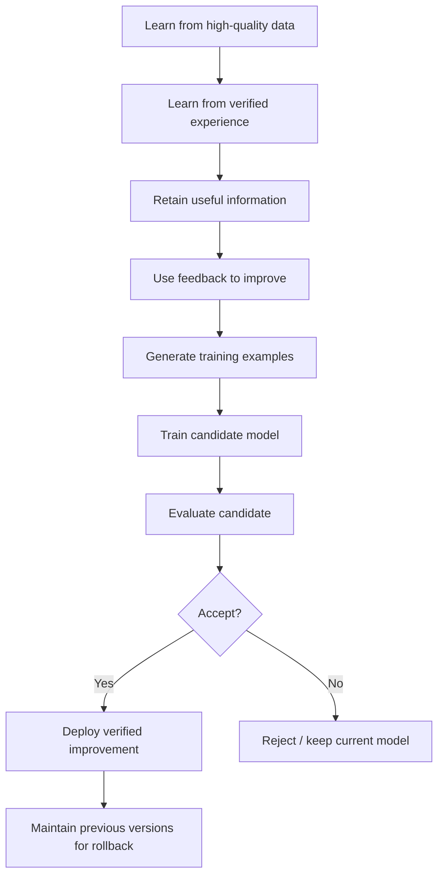
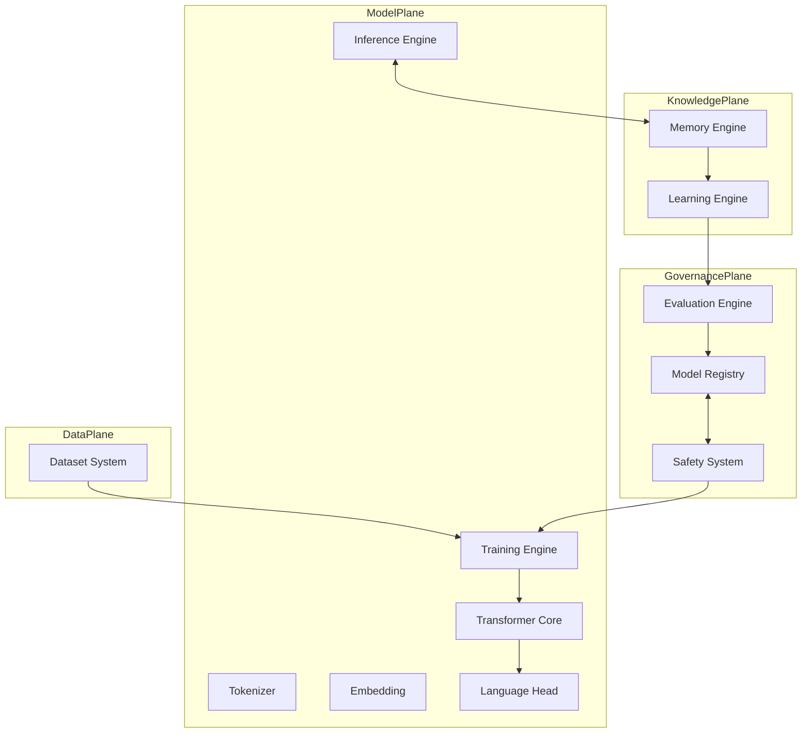

# Astra Architecture & Master Technical Specification

> This document is the master technical specification for the **Astra** project. It defines project identity, scope, core objectives, philosophy, technology stack, and the overall system architecture. It is designed to evolve alongside Astra and is the canonical reference for all design decisions.
>
> Status markers used throughout:
> - **STATUS: PROPOSED** — Design finalized as a written decision, not yet experimentally validated.
> - **STATUS: VALIDATED (as design)** — Design finalized AND experimentally validated at toy scale (Astra 0.1.0, docs/PHASE0.md).
> - **STATUS: VALIDATED** — Backed by a reproducible experiment or measurement in this repository.
> - **STATUS: RESEARCH** — Open research question; may be speculative.

---

## Table of Contents

1. [Project Identity](#1-project-identity)
2. [Core Objective](#2-core-objective)
3. [Development Philosophy](#3-development-philosophy)
4. [Technology Stack](#4-technology-stack)
5. [Astra Architecture](#5-astra-architecture)
6. [Module Specifications — High Level](#6-module-specifications--high-level)
7. [Repository Structure](#7-repository-structure)
8. [Specification Status Register](#8-specification-status-register)

---

## 1. Project Identity

### 1.1 Project Vision

Astra's vision is a machine-learning system that becomes **measurably more capable over time** through verified experience — learning from high-quality data, retaining useful information, and improving through a controlled, auditable loop of training, evaluation, and deployment — all without discarding what it already knows.

### 1.2 Project Mission

To build a reproducible, modular, openly documented AI research stack — from tokenizer to training to memory to self-improvement — that supports **continuous controlled learning** and is understandable and maintainable by a community of researchers and engineers.

### 1.3 Long-term Objective

Build an AI system capable of:

| Capability | Definition |
|---|---|
| Learning from high-quality data | Pretraining and continued training on curated, deduplicated, licensed data |
| Learning from verified experience | Converting measured, confirmed outcomes from interaction into training signal |
| Retaining useful information | Durable external memory plus stable model knowledge |
| Using feedback to improve | Filtered, confidence-weighted feedback fed into candidate training |
| Generating training examples | Producing synthetic examples that are later validated |
| Training candidate model versions | Building candidate models on separate checkpoints, never in place |
| Evaluating candidate versions | Running a fixed benchmark suite against every candidate |
| Rejecting inferior models | Automatic and manual rejection gates with explicit evidence |
| Deploying verified improvements | Promoting only candidates that pass all gates |
| Maintaining previous versions for rollback | Immutable version registry with instant rollback |

### 1.4 Core Principles

1. **Reproducibility** — every experiment must be reproducible from recorded state (code, config, data hash, seed).
2. **Transparency** — no silent changes; every model change is logged, versioned, and auditable.
3. **Controlled continual learning** — learning happens through candidate model generation and evaluation, not uncontrolled real-time weight modification.
4. **Evaluation before deployment** — no candidate becomes the active model without passing the benchmark suite.
5. **Safety and rollback** — every deployment can be reverted; every dataset and model is versioned.
6. **Data quality over quantity** — a small verified corpus beats a large noisy one.
7. **Efficient computation** — consumer-hardware-friendly development; scaled workloads only when justified.
8. **Honest claims** — measure, then claim. Never extrapolate unmeasured capability.

### 1.5 Design Philosophy

- **Build from first principles where practical.** Prefer implementing and understanding our own modules over accumulating opaque dependencies. Where a mature library is genuinely superior (e.g., tokenization libraries, backends), document why we reuse it.
- **Minimal viable components.** Every subsystem must exist standalone, be testable, and be replaceable.
- **Evidence-driven.** Architectural changes require a recorded hypothesis, an experiment, and a measurement.
- **Separation of concerns.** Data, model, memory, learning, evaluation, and safety are independent modules with defined interfaces.
- **Explicit assumptions.** Every design decision records its assumptions so future maintainers can challenge them.

### 1.6 What Astra Is

Astra is:

- An open-source, from-scratch language model research project.
- A training, memory, and learning system built around a Transformer core.
- A controlled self-improvement framework with versioned models, benchmark gates, and rollback.
- A research platform for continual learning, memory, retrieval, and synthetic-data studies.

### 1.7 What Astra Is Not

Astra is **not**:

- A wrapper around a commercial AI API (OpenAI, Anthropic, Google, etc.). Astra's model weights and training code are independently developed and owned.
- A chatbot product. No deployment/packaging commitments beyond research deliverables.
- A claim to AGI, consciousness, sentience, or human-level intelligence.
- A replacement for rigorous evaluation and human oversight.
- An unsupervised autodidact that arbitrarily modifies its own weights at runtime.

### 1.8 Self-Learning in Astra (Definition)

**Self-learning** means: the system converts recorded, verified experience into improved capability through a **controlled pipeline** — observation → feedback → validated training example → candidate model → evaluation → (accept/reject). The model does not "learn" every interaction; it learns only from experiences that pass validation and survive comparison against a baseline.

### 1.9 Self-Improvement in Astra (Definition)

**Self-improvement** means: a measurable, versioned improvement in evaluated capability from model version *N* to version *N+1*, achieved through the controlled pipeline, where version *N+1* strictly passes the benchmark suite and version *N* remains deployable for rollback.

### 1.10 Memory vs. Learning vs. Fine-Tuning vs. Weight Modification

These terms are frequently confused. Astra defines them precisely:

| Term | Definition | Where it lives | Performs learning? |
|---|---|---|---|
| **Memory** | External, structured records of facts, episodes, and semantics that are retrieved at inference time. | External store (vector DB, record store) | No — it is storage and retrieval. Weights unchanged. |
| **Learning** | The process of converting data/experience into improved model behavior via weight updates in a **candidate** model. | Training pipeline on candidate models | Yes — the mechanism is training. |
| **Fine-tuning** | Continued training of an existing model on a specific distribution (e.g., instruction data) with a small learning rate. | Candidate continued training | Yes — but bounded and intentional. |
| **Model-weight modification** | Direct, in-place updates to the weights of the active model. | Active model | Astra does **not** use uncontrolled in-place updates as a primary learning mechanism (see § 2.2). |

Key rule: **Memory changes the prompt. Learning changes the candidate weights. Evaluation changes the active model. Never in-place without a gate.**

---

## 2. Core Objective

### 2.1 The Ultimate Objective

Astra's ultimate objective is to operationalize the loop:



Astra succeeds when this loop runs continuously, measurably, and safely — with every step logged and every promotion explainable.

### 2.2 Why Uncontrolled Real-Time Weight Modification Is Rejected

Uncontrolled real-time weight modification (updating the active model's weights as it generates) is **not** used as the primary learning mechanism. Reasons:

1. **Catastrophic forgetting** — single-example in-place updates overwrite general knowledge with the latest sample.
2. **Feedback poisoning** — a single malicious or erroneous interaction would directly corrupt the model, with no gate.
3. **Non-reproducibility** — the model state depends on the exact history of interactions; two instances diverge forever.
4. **No rollback** — a corrupted weight state cannot be cleanly reverted.
5. **Reward hacking** — rapid in-place updates make gaming the reward signal trivial and undetectable.
6. **Unmeasurable** — no fixed snapshot exists to evaluate improvements against.

In-place, in-context adaptation (e.g., prompt-based memory retrieval) **is** allowed because it does not alter weights. Only gated candidate-model training alters weights.

---

## 3. Development Philosophy

| Principle | Meaning in Astra |
|---|---|
| **Build from first principles** | Implement core components ourselves where feasible; document every external dependency and its justification. |
| **Reproducibility** | Every run records: code commit, config, dataset hashes, seed, hardware, and library versions. |
| **Modularity** | Each subsystem is a separately testable module with a stable interface. |
| **Experiment-driven development** | No major change without a hypothesis, experiment, and measurement. |
| **Measurable improvement** | Improvement is defined by the benchmark suite, never by training loss alone. |
| **Data quality over quantity** | Verification and deduplication outrank volume. |
| **Controlled continual learning** | Learning via candidate + evaluation + accept/reject; never uncontrolled in-place updates. |
| **Model versioning** | Every model is an immutable, checksummed artifact. |
| **Evaluation before deployment** | Gates before promotion, always. |
| **Safety and rollback** | Poisoning defenses, audit logs, instant revert. |
| **Efficient computation** | Consumer-hardware-first; scale only when evidence justifies. |
| **Transparent documentation** | This spec, updates via PRs, no undocumented decisions. |

---

## 4. Technology Stack

### 4.1 Overview

| Language | Role | Scope |
|---|---|---|
| **Python** | Research, training, dataset processing, experimentation, evaluation | Default language for the training/research stack |
| **Rust** | High-performance inference, core runtime, memory systems, model management | The production runtime and memory engine |
| **C/C++** | Optional low-level optimization: SIMD, hardware-specific acceleration, GPU kernels | Used only where benchmarking shows Rust is insufficient |

### 4.2 Python — Why

- **Research velocity.** Ease of iteration with PyTorch, numpy, tokenizers, datasets.
- **Reference implementation.** The training stack is the source of truth for model behavior.
- **Data and evaluation ecosystem.** Mature tooling for datasets, benchmarks, metrics.

**Where Python should NOT be used:**
- Hot inference loops / per-token generation paths (Python overhead dominates).
- The core memory engine's retrieval hot path.
- Embedded/server deployments where predictable resource use matters.

### 4.3 Rust — Why

- **Deterministic, low-overhead inference.** Great for the generation hot loop, KV-cache management, and batched decoding.
- **Memory systems.** Safe, fast structured storage and vector search without GC pauses.
- **Model management / registry.** Robust file handling, hashing, atomic promotion, high concurrency.
- **Deployment surface.** Single static binary; no Python runtime requirement.

**Where Rust should NOT be used:**
- For day-one research prototyping of exotic model architectures (Python is faster to pivot).
- In the Python training stack — Rust bindings are optional and called only behind profiled interfaces.

### 4.4 C/C++ — Why (and When)

- Optional last-resort optimization: SIMD kernels, custom GPU kernels, memory-layout tricks.
- Only introduced after profiling shows a targeted Rust bottleneck.

**Where C/C++ should NOT be used:**
- As the default implementation language anywhere in Phase 0–4.
- Anywhere safety would be risked without a clear measurement reward.

### 4.5 Interop

- Rust exposes **C-ABI or cbindgen** bindings; Python calls them via `ctypes`/`PyO3`/`maturin`.
- The Python `astra.memory` module delegates hot-path retrieval to the Rust `astra-memory` crate.
- A single **on-disk artifact format** (versioned, checksummed) is shared by Python and Rust.

**STATUS: PROPOSED**

---

## 5. Astra Architecture

### 5.1 High-Level Pipeline


### 5.2 Module Boundary Diagram



### 5.3 Modules (Specification-Level)

| Module | Responsibility | Interface (in/out) |
|---|---|---|
| **Tokenizer** | Text ↔ token IDs; vocabulary management | Text → IDs → Text |
| **Vocabulary** | Token metadata, special tokens, statistics | ID → deserialized token |
| **Embeddings** | Token ID → dense vector; wte/wpe tables | IDs → `(batch, seq, d)` |
| **Positional encoding** | Position identity; optional RoPE (recommended) | positions → position-aware hidden states |
| **Attention** | Multi-head causal attention, KV-cache, masks | hidden → contextual hidden |
| **Transformer blocks** | N stacked norm + attention + FFN blocks | hidden → deeper hidden |
| **Normalization** | RMSNorm (recommended) / layernorm | hidden → normalized hidden |
| **Feed-forward network** | SwiGLU (recommended) / MLP | hidden → expanded hidden → projected |
| **Output head** | Final logits over vocabulary | hidden → logits (sometimes tied to wte) |
| **Training engine** | Optimizer, scheduler, loss, mixed precision, checkpoints | config + data + model → checkpoints + metrics |
| **Inference engine** | Token generation, sampling, streaming; (Rust) | model + context → tokens |
| **Memory engine** | External knowledge store, retrieval, ranking, lifecycle | query → ranked memory records |
| **Learning engine** | Feedback intake, experience eval, example generation, candidate kicks | experience + current model → candidate model |
| **Evaluation engine** | Benchmark harness, metrics, gates | candidate model → gate pass/fail report |
| **Model registry** | Immutable versioned storage, promotion, rollback | snapshot → registry entry |
| **Dataset system** | Ingestion, cleaning, dedup, splits, contamination checks | raw sources → train/val/eval/feedback splits |
| **Safety system** | Validation, filtering, gates, audit, poisoning defense | any stage → allow/deny + audit record |

---

## 6. Module Specifications — High Level

Each module has a dedicated detailed document:

| Module family | Detailed spec |
|---|---|
| Model | `docs/MODEL.md` |
| Training | `docs/TRAINING.md` |
| Data | `docs/DATA.md` |
| Tokenizer | `docs/TOKENIZER.md` |
| Memory | `docs/MEMORY.md` |
| Learning & feedback | `docs/LEARNING.md` |
| Evaluation & benchmarks | `docs/EVALUATION.md`, `docs/BENCHMARKS.md` |
| Safety | `docs/SAFETY.md` |
| Hardware/performance | `docs/HARDWARE.md`, `docs/EVALUATION.md` § performance |

---

## 7. Repository Structure

```
astra/
├── docs/            Master technical specification and module docs
├── configs/         Model, training, and experiment configs (YAML/JSON)
├── datasets/        Dataset definitions, provenance, versioned manifests
├── tokenizer/       Tokenizer training scripts and data
├── model/           Model architecture definitions (PyTorch reference)
├── training/        Training loop, optimizers, schedulers, checkpoints
├── inference/       Python reference inference; wires to Rust runtime
├── memory/          Memory engine (Python reference + Rust bindings)
├── learning/        Learning engine: feedback, experience, candidate generation
├── evaluation/      Evaluation harness and metrics
├── safety/          Validation, gates, audits, poisoning defenses
├── runtime/         Rust runtime: serving, model loading, KV-cache, memory store
├── rust/            Rust crate workspace source
├── python/          Python package (astra-py) source, bindings
├── tests/           Unit + integration tests (mirrors module layout)
├── benchmarks/      Benchmark definitions and recorded results
├── experiments/     Experiment logs, hypotheses, results (research notes)
├── checkpoints/     Model checkpoints and registry (git-ignored)
└── tools/           Dev/CI utilities, linting, release scripts
```

Directory responsibilities are elaborated in the appendix of this document and enforced by `CONTRIBUTING.md`.

---

## 8. Specification Status Register

| Section | Status |
|---|---|
| Project identity | VALIDATED (as policy) |
| Rejection of in-place weight modification | VALIDATED (as policy) |
| Technology stack | VALIDATED (as policy) — Python reference implementation chosen, implemented, and validated (ADR-0002, Astra 0.1.0) |
| High-level architecture | VALIDATED (as design) — pipeline, modules, and repo structure implemented per spec; validated at toy scale (Astra 0.1.0) |
| Transformer-based model | DESIGN DECIDED + validated at toy scale (Astra 0.1.0, H0.2–H0.4) — module configs vary per scale |
| Memory engine design | PROPOSED (Phase 4+) |
| Learning engine design | RESEARCH (Phase 5+) |
| Self-improvement loop | RESEARCH (Phase 6+) |

### Phase 0 / 0.1.0 components (implementation-tier)

| Component | Status (evidence) |
|---|---|
| Tokenizer (byte-level BPE) | VALIDATED — `docs/TOKENIZER.md`, EX-01 (round-trip exact, 6.84 B/token) |
| Data pipeline + manifests | VALIDATED — `docs/DATA.md`, EX-05 (decontamination, leak-free splits) |
| Training + reproducibility contract | VALIDATED — `docs/TRAINING.md`, EX-03/04 (CE 2.535, bit-identical) |
| Evaluation harness | VALIDATED — `docs/EVALUATION.md`, EX-06 (checksum-tied JSON report) |

### Phase 2 / 0.2.0 Training Foundation (implementation-tier)

| Component | Status (evidence) |
|---|---|
| Config-driven runs | VALIDATED — `training/train.py` + `configs/toy_pretrain.json` |
| Optimizer/scheduler registry | VALIDATED — `astra/training/optim.py` (`OPTIMIZER_REGISTRY`, `SCHEDULE_REGISTRY`, `build_optimizer`/`build_schedule`), exercised by registry tests |
| Gradient accumulation | VALIDATED — `accum_steps` in `astra/training/loop.py`; equivalence test proves N micro-batches ÷ N == one macro batch; `accum_steps=1` bit-identical |
| Experiment tracking | VALIDATED — `astra/experiments/store.py` (`ExperimentStore`) + `tools/experiments.py` CLI, queryable |
| Run manifests + audit env | VALIDATED — `git_commit`/`environment` recorded in `report.json`/`final.manifest.json` |
| Reproduction guarantee | VALIDATED — same-seed determinism test (bit-identical loss trajectory) |
| LR sweeps / mixed precision / distributed | PROPOSED — Phase 2+ research (docs/TRAINING.md §§ 3–4, 2.12) |
| Safety & hygiene gates | VALIDATED — `docs/SAFETY.md` (sanitize, dedup, leak gate, abort-on-contamination) |
| Reference inference / generation | VALIDATED — `generation` path driven by `evaluation/evaluate.py`, Astra 0.1.0 |

---

## Appendix A — Directory Responsibilities

| Directory | Responsibility |
|---|---|
| `docs/` | The specification. All substantive design changes must update a doc in the same PR. |
| `configs/` | Machine-readable experiment and model configs; every run references a config file. |
| `datasets/` | Versioned dataset manifests with provenance, licenses, hashes, contamination checks. |
| `tokenizer/` | Tokenizer training configs, vocab artifacts, quality reports. |
| `model/` | Reference model implementations; one file per component family. |
| `training/` | Training entrypoints and loop components; reproducible-by-config. |
| `inference/` | Generation APIs and the Python↔Rust inference bridge. |
| `memory/` | Memory record schema, store implementations, retrieval, ranking. |
| `learning/` | Feedback schema, experience store, example generation, candidate pipeline. |
| `evaluation/` | Harness code and metric implementations; gates read from here. |
| `safety/` | Filters, validators, audit log writers, poisoning detectors. |
| `runtime/` | Rust serving runtime and FFI surface consumed by Python. |
| `rust/` | Rust workspace: `astra-core`, `astra-inference`, `astra-memory`, `astra-runtime`. |
| `python/` | Installable `astra-py` package and PyO3 bindings. |
| `tests/` | Mirrors module layout; unit + integration. |
| `benchmarks/` | Benchmark definitions and timestamped result artifacts. |
| `experiments/` | Research notebooks/notes per experiment ID; links to artifacts. |
| `checkpoints/` | Immutable, checksummed model artifacts + registry JSON. Git-ignored content. |
| `tools/` | Scripts: lint, format, CI, release, checksum, dataset validation. |