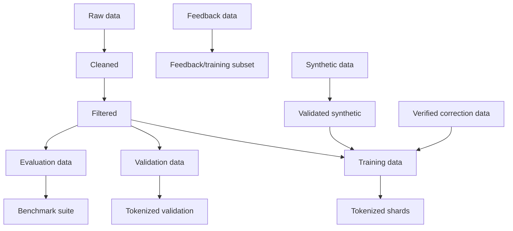

# Astra Dataset System

> Data architecture: provenance, cleaning, splits, contamination control.

**STATUS: PROPOSED**

---

## 1. Overview

Astra's learning quality depends on data discipline. The dataset system enforces strict separation between training and evaluation data, tracks origin, and applies contamination controls.



---

## 2. Dataset Stores

### 2.1 Raw Data

- Original bytes from sources — never mutated.
- Stored read-only with provenance (source, license, scrape/harvest metadata, hash).
- Examples: public corpora, licensed datasets, project-collected dialogue.

### 2.2 Cleaned Data

- Raw after deterministic, versioned cleaning rules (encoding, whitespace, control chars, language normalization, markdown noise removal where policy requires).
- Reversible/recorded: every rule has an ID; a re-run with same rules + same raw must produce identical cleaned output (hash-stable).

### 2.3 Filtered Data

- Cleaned after **allow/deny filtering**:
  - Toxicity/PII/harm filters (see `docs/SAFETY.md`).
  - Quality filters (perplexity-based or heuristic) — recorded, not black-box.
  - License/eligibility check.
- Filter statistics recorded per corpus.

### 2.4 Training Data

- A filtered subset designated for training. Trains the model.
- Any token in training data is permanently excluded from evaluation/benchmark data (see contamination).

### 2.5 Validation Data

- Frozen subset used to compute validation loss during training.
- Never mixed with training. Frozen for the project lifetime. Hash recorded.

### 2.6 Evaluation Data

- Unseen, held-out data for the external benchmark suite and internal Astra benchmarks.
- **Never** allowed into cleaning→training path. Two-way boundary.
- Each benchmark item has: id, source, hash, license, expected category (see `docs/BENCHMARKS.md`).

### 2.7 Feedback Data

- Interaction outcomes from the system (positive/negative/reward signals, corrections).
- Stored with confidence, source (AI/human), timestamp, and a verification status.
- Never enters the training corpus until it is **validated** (see `docs/LEARNING.md`).

### 2.8 Synthetic Data

- AI-generated examples produced by Astra or other generators.
- Always earmarked as synthetic; always screened (factuality prompts may be used); only entering training after passing a quality gate.
- Record generator field in every synthetic example.

### 2.9 Verified Correction Data

- Corrected outputs (explicit corrections verified by humans or strong automated checks).
- Highest priority for learning: goes toward candidate training and memory corrections.
- Example: a user corrects "Paris is the capital of X" → verified fact stored to memory and optionally used as a training example. Correctness must be verified; corrections are not auto-trusted (see `docs/LEARNING.md`).

---

## 3. Contamination & Leakage

**Data contamination** = training data overlapping with evaluation/benchmark data.

**Data leakage** = information seen during evaluation leaking into the model or its evaluation artifacts (e.g., tuning on the eval set, or memory retrieved during eval that came from train data).

### 3.1 Rules

1. No benchmark/eval item may appear in the training corpus at the token, document, or n-gram-overlap level beyond a recorded safety threshold.
2. MinHash/n-gram overlap-based leakage check runs on every corpus slice before training data is finalized.
3. Memory stores are **quarantined** from benchmark evaluation unless the benchmark explicitly measures retrieval.
4. When a leakage event is found, data is re-split — not patched silently — and a record is added to the data manifest.

### 3.2 Contamination Detection

- Exact hash matching.
- 13-gram overlap (popular standard) with disallow list for eval items.
- Document-level MinHash at ~Jaccard 0.85 cutoff to catch near-duplicates.
- Thresholds and procedures recorded in `tools/`.

---

## 4. Manifest Format (Schema)

Every dataset slice carries a manifest JSON:

```json
{
  "name": "astra-wiki-v1",
  "kind": "training",
  "source_ids": ["..."],
  "license": "cc-by-sa-4.0",
  "created_at": "ISO8601",
  "cleaning_rules": ["enc-normalize-v1", "utf8-null-v1"],
  "filters": [ {"id": "pii-v1", "params": {}} ],
  "hash": { "algorithm": "sha256", "value": "..." },
  "documents": 123456,
  "tokens": 4567890123,
  "contamination_checked": true,
  "leakage_report": "link"
}
```

Manifests are versioned in git; content is referenced by hash.

---

## 5. Splits Policy

- **Training:** majority of filtered data.
- **Validation:** frozen 0.5–1% slice, never updated.
- **Evaluation:** curated external benchmark + internal Astra suite, frozen slices with versioned manifests.
- **Feedback/synthetic/corrections:** kept separate until validated, then added to a training slice via versioned manifest change.

---

## 6. Data Quality Metrics (Reported per corpus)

- Documents, tokens, per-doc token length distribution.
- Dedup redundancy ratio.
- Filter rejection rate (and top rejection reasons).
- Contamination scan results.
- Vocabulary/coverage report (tokenizer check).