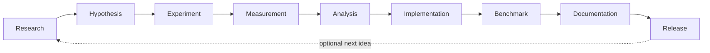

# Astra Development Methodology

> How Astra development works: research → experiment → measurement → implementation → release.

**STATUS: PROPOSED** — process decided; tooling to refine per phase.

---

## 1. The Development Loop



| Stage | Deliverable | Notes |
|---|---|---|
| **Research** | Survey notes, candidate ideas in `experiments/` | Cite sources; record assumptions |
| **Hypothesis** | One falsifiable statement with a metric | e.g., "RMSNorm reduces loss 0.05 vs LayerNorm at same budget" |
| **Experiment** | Script + config + seed + data hash | Reproducible artifact |
| **Measurement** | Numeric results, error bars, artifacts | Saved in `benchmarks/results/` |
| **Analysis** | Does evidence support hypothesis? | Write-up in `experiments/` |
| **Implementation** | Code change + tests | Only if evidence supports |
| **Benchmark** | Full suite re-run; compare to baseline | Gate before merge/PR |
| **Documentation** | Update `docs/` in same PR | Spec must reflect reality |
| **Release** | Follow `docs/RELEASES.md` | Gates + changelog |

---

## 2. Every Major Architectural Change Requires Measured Evidence

- A PR that changes model, training, memory, or inference behavior **must** include a benchmark/reproduction section.
- If a change is not yet validated, it merges as **experimental** (behind a flag/config) and is documented `STATUS: RESEARCH`.
- No claim of improvement ships without its experiment ID and numbers.

---

## 3. Environment & Config Discipline

- All experiments resolve from a config in `configs/` (no hard-coded hyperparams in scripts).
- Run manifests record environment; reproductions must not silently change data or dependencies.
- Secrets never in configs; use env injection (never committed).

---

## 4. Branch & PR Guidance

- Feature branches per change; PRs typically < ~400 lines.
- Every PR touches tests and docs when behavior changes.
- CI runs: lint + unit tests + (when model-affecting) benchmark smoke run.

---

## 5. Documentation of Decisions

- **ADR style:** significant decisions recorded under `experiments/adr/<id>-<title>.md` (structured: context, decision, alternatives, consequences, status, evidence).
- The linked module doc is updated to keep the spec current.

---

## 6. Experiment Template

```markdown
# Experiment <id>: <title>
- Date, author
- Context / motivation
- Hypothesis (falsifiable, with metric)
- Setup: config ref, data manifest, seed, hardware
- Method
- Results (tables/plots with error bars where relevant)
- Analysis / conclusion
- Evidence links (artifacts, logs)
- Decisions triggered (or none)
- Status: PROPOSED | VALIDATED | REJECTED
```

---

## 7. Standards

- Python: PEP 8 with black/isort/ruff; type hints required for public APIs.
- Rust: rustfmt, clippy clean; `cargo test`.
- Tests must run green on `pytest tests/` and `cargo test`.
- Docs updated in the same PR as the code they describe.