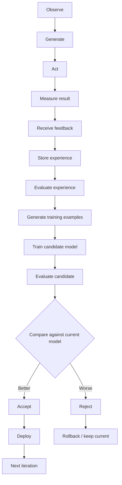

# Astra Self-Learning System

> The learning loop, feedback system, and candidate improvement mechanism.

**STATUS: RESEARCH** — framework design is decided; details (reward weights, thresholds, curriculum) are open research.

---

## 1. The Learning Loop



Loop stages are defined below.

### 1.1 Observe
Capture the request, context, retrieved memory (if any), and the generated output.

### 1.2 Generate
The model produces a candidate response using the current active model (weights) + working context (memory).

### 1.3 Act
The output is delivered/executed in its environment (answer, tool use later). Actions are scoped and permissioned.

### 1.4 Measure Result
Automated signals: task completion, verifiable outcome, time taken, resource usage. Where objective truth exists (code running, math verified, fact checked), record the result.

### 1.5 Receive Feedback
Feedback arrives from humans, automated reward signals, and explicit corrections. **Not trusted blindly** — see § 3.

### 1.6 Store Experience
A validated or pending experience record is appended to the experience store (separate from memory; see `docs/MEMORY.md`).

### 1.7 Evaluate Experience
The experience is scored for quality, confidence, verifiability, and safety. Rejected experiences are logged but never used for training.

### 1.8 Generate Training Examples
Validated experiences become training examples:
- SFT-style: corrected output pairs (input, accepted output).
- Preference pairs: (input, good output, bad output) when compare-verified.
- Fact/correction pairs routed to memory store for memory learning.

### 1.9 Train Candidate Model
A candidate model is trained **off the active checkpoint** (never in place), on a small, validated, safe set of experience examples. Low LR, warmup, replay/corpus mix to prevent forgetting.

### 1.10 Evaluate Candidate
The candidate must pass the full benchmark suite: capability, safety, regression, resource tests (`docs/EVALUATION.md`, `docs/BENCHMARKS.md`).

### 1.11 Compare Against Current Model
Candidate vs active model:
- Strict non-regression on core suite.
- Gain on target metrics.
- Confidence bounds from repeated eval runs.

### 1.12 Accept or Reject
- **Accept** if gates pass and gains are statistically meaningful.
- **Reject** otherwise; candidate deleted (or archived in registry as "rejected candidate").

### 1.13 Deploy or Rollback
- Accept → promote in registry (immutable), audit complete.
- Reject → current model unchanged; a regression discovered post-deploy triggers automatic rollback to previous registered version.

---

## 2. Why the System Must Not Auto-Trust Every Interaction

- A single erroneous correction, poisoned feedback, or adversarial prompt could corrupt learning if admitted blindly.
- The pipeline filters at: feedback intake (confidence/source), experience evaluation (validation), training-example generation (dedup/quality), candidate evaluation (gates).
- Trust tiers: verified human > automated check > model self-score > raw user signal.
- Unexpected/unverifiable feedback goes to a review queue, not straight to training.

---

## 3. Feedback System

### 3.1 Feedback Types

| Type | Source | Example | Trust |
|---|---|---|---|
| Positive feedback | User, automated | Thumbs-up, task success | Medium default (adversarial spoofable) |
| Negative feedback | User, automated | Thumbs-down, failure signal | Medium |
| Explicit correction | User/human | "It should be X" | High after verification |
| Human verification | Vetted human | Fact-check confirm | Highest |
| Automated evaluation | Benchmarks, code-run | Pass/fail on test | High (deterministic) |
| Reward signals | Environment | Completion, correct proof | Variable — trust-modeled |
| Confidence scores | Model self-eval | Self-consistency, calibration | Lowest-trusted; weight only with support |

### 3.2 Unreliable-Feedback Filtering

Filters in cascade: source/authenticity → plausibility (does it agree with existing high-confidence memory? if contradicts, dispute path) → consistency (multiple independent confirmations) → calibration (low-confidence ignored for training; surfaced for human review) → dedup. Anything failing at any stage is quarantined.

---

## 4. Self-Improvement Framework

### 4.1 Versioned Models

Astra maintains a strict lineage:

```
Model V1 → Model V2 → Model V3 → …
```

Every version:
- Registered with SHA-256 checksum in the model registry.
- Kept on disk for rollback (retention policy: last-N plus long-term archive per config).
- Accompanied by: config, data manifest, training record, full eval report, decision record.

### 4.2 Candidate Checkpoints

Candidate training starts from the active checkpoint with a candidate-labeled set; candidates are separate artifacts, never the promoted model until gates pass.

### 4.3 Gate Suite (Summary)

Every candidate must pass before promotion:

- **Benchmark suite:** core + task benchmarks (`docs/BENCHMARKS.md`).
- **Regression tests:** automated re-runs of key capabilities comparing to prior version.
- **Safety tests:** detection of poisoning/harm regressions (`docs/SAFETY.md`).
- **Capability tests:** no silent loss of known skills.
- **Performance tests:** latency/RAM/GPU within budget.
- **Resource tests:** footprint within config bounds.
- **Automatic rollback:** RTO measured; on regression, revert in-place candidate, restore previous model.

### 4.4 Promotion Decision

Promotion is decided by the gate engine + human approval (config = auto vs manual threshold). Every promotion writes an immutable audit record. Distribution drift triggers re-training, not silent promotion.

---

## 5. Failure Modes the Ridge Guard Prevents

| Mode | Guard |
|---|---|
| Data poisoning | Contamination scan, safety filters on all sources |
| Feedback poisoning | Trust tiers, verification, quarantine |
| Model collapse | Diversity checks on experiences; replay corpus; synthetic-data guardrails |
| Catastrophic forgetting | Low LR, replay memory of prior tasks, eval gates on known capabilities |
| Reward hacking | Gates measure general capability, not just reward-max; reward signals independently checked |
| Distribution drift | Drift detector on eval slices; unexpected changes route to human review |

Rollback and audit are the terminal safety net for all of the above.