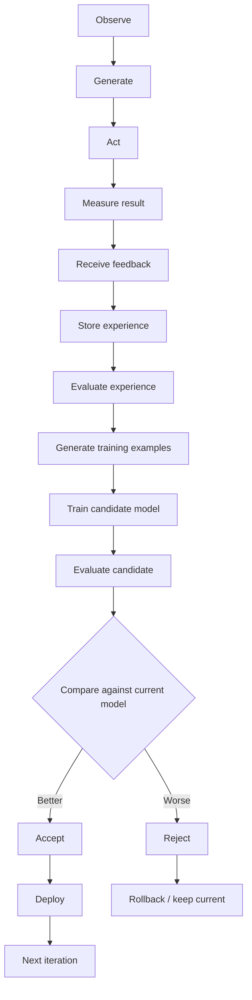

# Astra Self-Learning System

> The learning loop, feedback system, and candidate improvement mechanism.

**STATUS: IMPLEMENTED (core)** — Phase-5 (Astra 0.7) learning engine v1: feedback
intake + validation cascade, experience store, and candidate trainer with
replay are implemented and reproducibly demonstrated end-to-end on the toy
model (`tools/learning_loop.py`): a candidate trained off the active checkpoint
on 10 validated human-verified facts improves held-out target-partition loss by
≈0.77 CE without regressing prior capability (+0.009 CE). Reward-weight tuning,
threshold curves, curriculum, and the automated promotion gate remain open
research.

---

## 1. The Learning Loop



Loop stages are defined below.

### 1.1 Observe
Capture the request, context, retrieved memory (if any), and the generated output.

### 1.2 Generate
The model produces a candidate response using the current active model (weights) + working context (memory).

### 1.3 Act
The output is delivered/executed in its environment (answer, tool use later). Actions are scoped and permissioned.

### 1.4 Measure Result
Automated signals: task completion, verifiable outcome, time taken, resource usage. Where objective truth exists (code running, math verified, fact checked), record the result.

### 1.5 Receive Feedback
Feedback arrives from humans, automated reward signals, and explicit corrections. **Not trusted blindly** — see § 3.

### 1.6 Store Experience
A validated or pending experience record is appended to the experience store (separate from memory; see `docs/MEMORY.md`). **Implemented** as
`astra/learning/experience.py` `ExperienceStore` — an append-only JSONL store of
training examples (kinds: `sft` / `preference` / `fact`) at `learning/store/`,
with deterministic content dedup (re-submission is a no-op), quarantine/
withdraw lifecycle for audit, and provenance back to the source `FeedbackRecord`.

### 1.7 Evaluate Experience
The experience is scored for quality, confidence, verifiability, and safety. Rejected experiences are logged but never used for training.

### 1.8 Generate Training Examples
Validated experiences become training examples:
- SFT-style: corrected output pairs (input, accepted output).
- Preference pairs: (input, good output, bad output) when compare-verified.
- Fact/correction pairs routed to memory store for memory learning.

**Implemented** via `astra/learning/feedback.py` `route_to_examples` — the
intake cascade (source/authenticity → tier policy → plausibility →
confidence → dedup) admits validated feedback and routes it to a training
example in the `ExperienceStore`; anything failing a stage is quarantined with
a review-queue reason and never trains.

### 1.9 Train Candidate Model
A candidate model is trained **off the active checkpoint** (never in place), on a small, validated, safe set of experience examples. Low LR, warmup, replay/corpus mix to prevent forgetting.

**Implemented** as `astra/learning/candidate.py` `train_candidate`: loads the
active checkpoint, fine-tunes on validated `sft`-kind experiences tokenized to
the pretraining BPE, interleaves the original pretraining corpus as a replay
stream (`replay_ratio`), and writes a separate candidate checkpoint under
`checkpoints/candidate/` with a manifest recording base-sha256, experience ids,
replay token count, seed, and git commit. Deterministic per
(seed, config, experiences, replay).

### 1.10 Evaluate Candidate
The candidate must pass the full benchmark suite: capability, safety, regression, resource tests (`docs/EVALUATION.md`, `docs/BENCHMARKS.md`).

**Implemented** as the comparison driver `tools/learning_loop.py` (§ 6): it
measures base vs candidate mean next-token CE on (a) a *held-out target
partition* never present in the experience store — so a loss reduction proves
generalization, not memorization — and (b) a *regression partition* sliced from
the original pretraining data — so a rising loss flags forgetting. A candidate
is provisionally `ACCEPT`-ed when target CE drops materially
(`< -0.1`) and regression stays bounded (`< +0.1`); the automated promotion
gate is Phase 6.

### 1.11 Compare Against Current Model
Candidate vs active model:
- Strict non-regression on core suite.
- Gain on target metrics.
- Confidence bounds from repeated eval runs.

### 1.12 Accept or Reject
- **Accept** if gates pass and gains are statistically meaningful.
- **Reject** otherwise; candidate deleted (or archived in registry as "rejected candidate").

### 1.13 Deploy or Rollback
- Accept → promote in registry (immutable), audit complete.
- Reject → current model unchanged; a regression discovered post-deploy triggers automatic rollback to previous registered version.

---

## 2. Why the System Must Not Auto-Trust Every Interaction

- A single erroneous correction, poisoned feedback, or adversarial prompt could corrupt learning if admitted blindly.
- The pipeline filters at: feedback intake (confidence/source), experience evaluation (validation), training-example generation (dedup/quality), candidate evaluation (gates).
- Trust tiers: verified human > automated check > model self-score > raw user signal.
- Unexpected/unverifiable feedback goes to a review queue, not straight to training.

---

## 3. Feedback System

### 3.1 Feedback Types

| Type | Source | Example | Trust |
|---|---|---|---|
| Positive feedback | User, automated | Thumbs-up, task success | Medium default (adversarial spoofable) |
| Negative feedback | User, automated | Thumbs-down, failure signal | Medium |
| Explicit correction | User/human | "It should be X" | High after verification |
| Human verification | Vetted human | Fact-check confirm | Highest |
| Automated evaluation | Benchmarks, code-run | Pass/fail on test | High (deterministic) |
| Reward signals | Environment | Completion, correct proof | Variable — trust-modeled |
| Confidence scores | Model self-eval | Self-consistency, calibration | Lowest-trusted; weight only with support |

### 3.2 Unreliable-Feedback Filtering

Filters in cascade: source/authenticity → plausibility (does it agree with existing high-confidence memory? if contradicts, dispute path) → consistency (multiple independent confirmations) → calibration (low-confidence ignored for training; surfaced for human review) → dedup. Anything failing at any stage is quarantined.

---

## 4. Self-Improvement Framework

### 4.1 Versioned Models

Astra maintains a strict lineage:

```
Model V1 → Model V2 → Model V3 → …
```

Every version:
- Registered with SHA-256 checksum in the model registry.
- Kept on disk for rollback (retention policy: last-N plus long-term archive per config).
- Accompanied by: config, data manifest, training record, full eval report, decision record.

### 4.2 Candidate Checkpoints

Candidate training starts from the active checkpoint with a candidate-labeled set; candidates are separate artifacts, never the promoted model until gates pass.

### 4.3 Gate Suite (Summary)

Every candidate must pass before promotion:

- **Benchmark suite:** core + task benchmarks (`docs/BENCHMARKS.md`).
- **Regression tests:** automated re-runs of key capabilities comparing to prior version.
- **Safety tests:** detection of poisoning/harm regressions (`docs/SAFETY.md`).
- **Capability tests:** no silent loss of known skills.
- **Performance tests:** latency/RAM/GPU within budget.
- **Resource tests:** footprint within config bounds.
- **Automatic rollback:** RTO measured; on regression, revert in-place candidate, restore previous model.

### 4.4 Promotion Decision

Promotion is decided by the gate engine + human approval (config = auto vs manual threshold). Every promotion writes an immutable audit record. Distribution drift triggers re-training, not silent promotion.

---

## 5. Failure Modes the Ridge Guard Prevents

| Mode | Guard |
|---|---|
| Data poisoning | Contamination scan, safety filters on all sources |
| Feedback poisoning | Trust tiers, verification, quarantine |
| Model collapse | Diversity checks on experiences; replay corpus; synthetic-data guardrails |
| Catastrophic forgetting | Low LR, replay memory of prior tasks, eval gates on known capabilities |
| Reward hacking | Gates measure general capability, not just reward-max; reward signals independently checked |
| Distribution drift | Drift detector on eval slices; unexpected changes route to human review |

Rollback and audit are the terminal safety net for all of the above.

---

## 6. Current Implementation (Phase-5 core, Astra 0.7)

Implemented modules and the end-to-end demonstration:

| Component | Module | Notes |
|---|---|---|
| Feedback record + intake cascade | `astra/learning/feedback.py` | `make_feedback`, `validate_feedback` (source → tier → plausibility → confidence → dedup), `route_to_examples`; quarantines on failure |
| Trust-tier policy | `astra/learning/__init__.py` | `TRUST_TIERS`, per-tier minimum confidence for training |
| Experience store | `astra/learning/experience.py` | append-only JSONL at `learning/store/store.jsonl`, content-dedup, quarantine/withdraw, provenance `feedback_id` |
| Candidate trainer | `astra/learning/candidate.py` | fine-tune off active checkpoint on validated `sft` examples + replay stream; separate candidate artifact + manifest |
| Eval driver | `tools/learning_loop.py` | intake → store → candidate → base-vs-candidate CE on held-out target + regression partitions (deterministic) |
| Eval set | `datasets/learning/nova_heldout.txt` | held-out paraphrase target; no line appears in the experience store |
| Cross-check tool | `tools/learning_eval.py` | substring-hit comparison of two checkpoints on a versioned JSON eval set |

### 6.1 Reproducible demonstration (toy `name` checkpoint)

```
$ python tools/learning_loop.py --steps 150
[intake] accepted 10 unique validated experiences into store
[train ] 150 steps, final CE 2.6436, checkpoints/candidate/final.npz
[eval  ] target_nova_loss      base=5.155 cand=4.380 delta=-0.775   (learned NEW fact: "Astra is from Nova")
[eval  ] regression_astra_loss base=2.832 cand=2.840 delta=+0.009   (did NOT forget prior capability)
[decision] ACCEPT (target CE delta -0.775, regression delta +0.009)
```

The candidate only improves the Nova partition (held out from training), so
the gain is generalization, not memorization of the 10 validated lines. The
replay stream keeps the Astra capability stable (CE +0.009, within noise).
Everything traces to the 10 `human_verification`-tier experiences in the store.

### 6.2 What remains for Phase-5 exit / Phase 6

- Preference-pair (ranking) training path — payload schema exists, trainer
  currently uses only the `good` path in `kind == "preference"`.
- Automated promotion gate (registry promotion + audit) — Phase 6.
- Reward-weight / threshold curves and feedback-confidence research —
  documented as open research above.
- Leak coverage for the live pipeline (`learning/store` is git-ignored like
  `memory/store`).