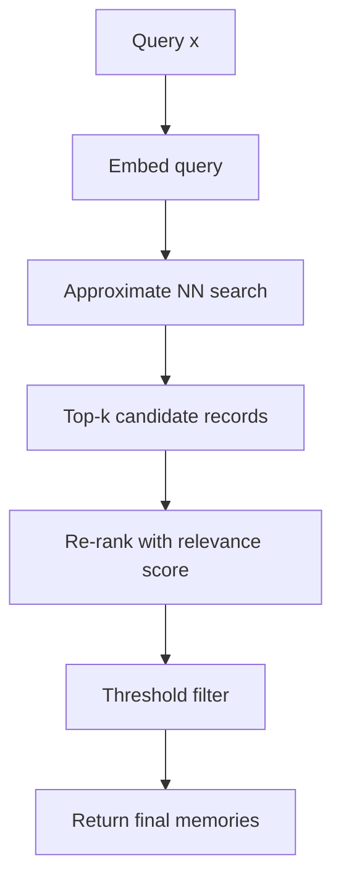

# Astra Memory System

> Memory architecture and retrieval.

**STATUS: PROPOSED** (design decided). **Engine v1 implemented** (2026-09-08,
Astra 0.5.0 in development): `python/astra/memory/` — immutable records, a
versioned JSON store, lifecycle (expiry/correction/soft-delete/conflict),
flat exact retrieval with hybrid ranking + token budget, `<|memory|>` working
-context injection, append-only audit log, the short/long-term session split
(`astra/memory/session.py`), and tooling (`tools/memory.py` CLI,
`tools/memory_eval.py` retrieval-quality eval,
`tools/memory_qa.py` long-form-QA RAG-vs-baseline). Evaluation set
(`datasets/memory/qa_v1.json`) and inference-service wiring landed too.
Rust store (`astra-memory` HNSW) and the retrieval-quality study remain
(see § 6/§ 7).

---

## 1. Definition and Scope

Memory in Astra is **external, structured, and versioned**. Memory is a storage/retrieval layer around the model, not a weight-level phenomenon. "Remembering" in Astra =
writing a record to memory; "recalling" = retrieving it into the working context at inference.

**Memory does not change weights.**

The model weights contain knowledge learned at training time (implicit statistical knowledge); memory contains explicit verifiable records (facts targeting claims, episodes, semantic summaries).

---

## 2. Memory Types

| Type | Definition | Contents | Lifecycle |
|---|---|---|---|
| **Short-term memory** | Working buffer during an interaction | Recent tokens, conversation context, in-progress thoughts | Expires with the session |
| **Long-term memory** | Durable persistent store | Facts, verified claims, semantic knowledge, episodic records | Persistent until explicitly corrected/deleted |
| **Semantic memory** | General facts and concepts | "Paris is the capital of France" — high confidence, cross-example | PRV: preference-vetting, versioning, correction |
| **Episodic memory** | Records of past specific events/interactions | "On 2026-09-06 user asked X, we answered Y, feedback Z" | Explicit record with source, timestamps |
| **Working context** | Input window assembled at inference | User prompt + retrieved memory + (optionally) world snapshot | Per-request ephemeral |

---

## 3. What Is Stored Externally vs. In Weights

| Information | Home | Rationale |
|---|---|---|
| High-confidence static facts | Memory (semantic) | Can be corrected without retraining; verifiable |
| Conversational history | Memory (episodic) | Session/scoped; not weight material |
| Vocabulary, grammar, general world knowledge priors | Weights (trained) | Compressed statistical generalization |
| Frequency/trend patterns | Weights (trained) | Emerges from pretraining |

Rule: **if a fact can change or be corrected, prefer external memory.** If it is a stable, high-frequency pattern, it is a weight candidate.

---

## 4. Memory Records

A memory record schema (v1, JSON-serializable):

```json
{
  "id": "mem_<uuid>",
  "kind": "fact" | "episode" | "semantic" | "session",
  "content": "Paris is the capital of France.",
  "embedding": "<vector or reference>",
  "source": "user_said" | "verified_correction" | "auto_extract" | "model_generated",
  "confidence": 0.92,
  "verification_status": "unverified" | "verified" | "disputed",
  "created_at": "ISO8601",
  "expires_at": "ISO8601 | null",
  "revision": 3,
  "deprecates": "mem_<uuid>",
  "tags": ["geography"],
  "attribution": ["source_ref_1"]
}
```

---

## 5. Embeddings

- Facts/episodes embedded by the Astra encoder (the model's last-layer or a dedicated embedding head — research decides which).
- Embedding version recorded (changes to embeddings require re-index of the store).
- Alternative embedding sources allowed only behind a documented interface.

---

## 6. Retrieval



- Index options: in-memory HNSW (Rust `astra-memory`), or flat with exact score on small stores.
- Retrieval is always bounded (k and token budget) to keep latency predictable.
- `query → memory_list` result plus scores and store version.

**v1 implementation (`astra/memory/retrieval.py`)**: flat exact cosine over
L2-normalised embeddings, top-k cap, and a hard token budget on returned
content (top record is always returned so retrieval never silently empties).
Embeddings are attached to records at write time; records missing an embedding
are lazily (re-)embedded on first search (audited as `reindex`). Filtering
excludes deleted/deprecated records, `disputed` records, and evals stuck in
the benchmark quarantine unless explicitly requested.

**Rust core (`service/rust`, GAP-4)**: `astra_rt::memory` implements the same
flat exact cosine search + base64-f32 embedding decode of Python store files;
the `astramem` CLI and `tools/rust_mem_crosscheck.py` assert top-k parity with
the Python reference (top-1 exact, top-k set match). ANN (HNSW) remains a
later milestone.

---

## 7. Ranking / Relevance Scoring

Baseline: hybrid of (a) embedding cosine, (b) heuristic recency, (c) confidence, (d) record kind weight.
`score = w1·cos + w2·recency + w3·confidence + w4·kind_weight` (proposed weights; a ranking ablation is research).

**v1 implementation (`astra/memory/ranking.py`)**: default weights
`{cosine: 1.0, recency: 0.15, confidence: 0.25, kind: 0.10}`, recency
`exp(-age/half_life)` with a 30-day half-life, kind weights
`{fact: 1.0, semantic: 1.0, episode: 0.8, session: 0.3}`. Weights are
injectable per query. Baseline measurements (2026-09-08,
`tools/memory_eval.py`, demo corpus from `datasets/memory/qa_v1.json`) —
HashEmbedder (lexical): hit@1 1.0 / hit@5 1.0 / MRR 1.0 / nDCG@5 0.99;
LiteLMExtractor on the toy checkpoint:
hit@1 0.27 / hit@5 0.82 / MRR 0.50 / nDCG@5 0.56 (toy encoder is the
bottleneck; re-measure with the real model).

**STATUS: ADOPTED (GAP-5, 2026-09-09)** — the GAP-5 ranking study
(`tools/memory_ranking_study.py` → `benchmarks/results/memory/ranking-study.json`)
swept a cosine/recency/confidence/kind weight grid on the demo corpus. Cosine-led
defaults are optimal (MRR 0.95); heavy recency (≥0.25 of the score) sharply hurts
MRR (down to 0.30 at equal weight), so recency stays a gentle tie-breaker. Adopted
thresholds (benchmarks/suites/core-retrieval.json v2): hit@1 ≥ 0.8, hit@5 = 1.0,
MRR ≥ 0.9, nDCG@5 ≥ 0.9, enforced by `tools/memory_eval.py --enforce` for the
HashEmbedder (the LiteLMExtractor-on-toy encoder is a documented non-gated
baseline, re-measure with the real model).

### 7.1 Evaluation set and RAG measurement

- **Eval set** `datasets/memory/qa_v1.json` (+ `manifest.json`): 10 facts,
  11 questions, authored (not scraped), leak-free vs all training splits.
  Facts are tagged **`eval-quarantine`** by the measurers and only enter
  retrieval via `allow_quarantine=True`, so evaluation memories cannot leak
  into the inference store by default.
- **`tools/memory_eval.py`** scores retrieval quality (hit@k / MRR / nDCG@5).
- **`tools/memory_qa.py`** measures RAG vs baseline at generation time:
  free-form fact-recall of greedy answers, gold-retrieval rate, and a
  conditioning probe (Δ next-token nats with vs without the memory block).
  First run (toy model) is a **negative control**: retrieval is correct
  (gold rate 0.92) but the toy decoder cannot exploit the fact domain (Δ
  recall 0.0, Δ nats −0.38); expect the positive signal from the real model
  (docs/PLAN-ASTRA-5M.md).

---

## 8. Memory Lifecycle

**v1 implementation (`astra/memory/store.py`)**: records are immutable;
correction creates a `revision+1` record whose `deprecates` points at the
superseded record (newest revision served, prior revisions retrievable only
via `include_all=True`); soft-delete always with auditable hard purge;
`expire()` TTL sweep; `mark_disputed`/`resolve` conflict queue + resolution
audit trail (no silent auto-wins).

### 8.1 Expiration

- Record-level `expires_at` for volatile facts (news-like). TTL audit run.
- Sessions auto-expire at session end.
- Configurable default TTL by kind.

### 8.2 Correction

- Correcting a memory record creates a **new revision** with `revision+1`, `deprecates` pointing at the superseded record.
- Revisions are immutable; the newest revision is used for retrieval. Undo is instant (rollback to prior revision).

### 8.3 Deletion

- Soft-delete always (audit). Hard-delete permitted only after review with `purge=True` flag recorded.

### 8.4 Conflict Resolution

- Same semantic content, differing facts → mark `disputed`, record both with high confidence none, surface to a resolution queue.
- Resolution requires verification (human, or automated cross-check) — never silent auto-wins.
- A conflict resolution audit trail is required.

### 8.5 Short/Long-Term Session Split

Short-term memory is a **working buffer during an interaction**, separate from
the durable long-term store (docs § 2). Implemented in
`astra/memory/session.py`:

- **Session records**: `SessionMemory(store, session_id, ttl=24h)` writes
  `kind="session"` records tagged `session:<id>`, TTL'd from write time.
- **Isolation**: `store.search()` recalls durable kinds only
  (`fact`/`episode`/`semantic`) by default, so conversation never pollutes
  global recall. Short-term recall goes through `SessionMemory.recall()`,
  which is scoped to one session (`kinds=["session"]` + `session:<id>`).
- **Lifecycle**: records auto-expire at TTL; `close()` soft-deletes the whole
  session in one audited batch. `expire`/`close` both hit the audit log.
- **Promotion**: `promote(session, rid, kind="fact")` copies a session record
  into a durable record (new id) whose attribution cites
  `promoted:from_session:<rid>`; the source session record still expires with
  the session. Promotions require explicit choice — nothing auto-promotes.
- CLI: `tools/memory.py remember --session S`, `session-recall`,
  `session-close`, `promote --id RID`.

---

## 9. Retrieval Injection (Working Context)

- At inference, retrieved memories are concatenated into a structured memory block within the prompt using the `<|memory|>` special token zone.
- Token budget enforced per request; retrieval respects a "memory budget" not to outsize the prompt.
- Model is never trained on memory content streams in Phase 1—3; memory-only during phases 4+ (training candidate interaction: memory-assisted prompting; memory content is not training data by default).

**v1 implementation (`astra/memory/injection.py`)**: `build_memory_block`
assembles ``<|memory|>`` … ``<|/memory|>`` with per-record ``<|mem|>`` zones
(ids included, optional kind labels) under a token budget; records that don't
fit are reported as dropped. `prepend()` offers the block ahead of a prompt.

**Wired into inference (2026-09-08, G1):** `service/inference.py` opens a store
with `--memory <name>` (embedder `hash` default or `litelm`, k and token
budget flags); every `/generate` retrieves for the prompt, prepends the block,
and reports `memory.included/dropped/block_tokens`; `"memory": false` opts out
per request. `inference/generate.py` recalls per turn and prints which records
were used.

---

## 10. Correctness & Safety

- All writes and reads are audited (`docs/SAFETY.md`).
- Memory is versioned as a database; every batch of writes is a transaction.
- Retrieval never returns records from the evaluation/benchmark quarantine without flagging.
- Sensitive/PII-tier records carry access flags; filtering in retrieval per query scope.

**v1 implementation**: every mutation appends a JSONL audit line and persists
the store atomically (temp-file + `os.replace`); reads are audited as `query`
lines with a query hash; the `eval-quarantine` tag is a hard retrieval
exclusion unless `allow_quarantine=True`. The store lives under
`memory/store/` (git-ignored, never `datasets/`). PII-tier access controls and
transactional batch writes remain for later milestones.