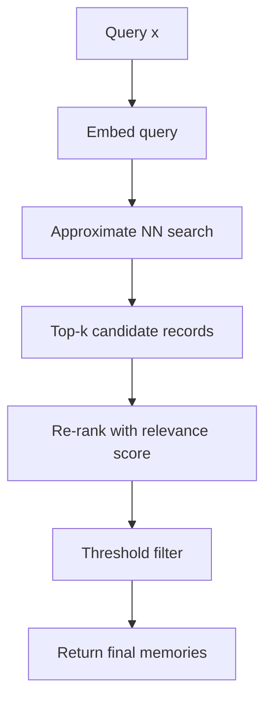

# Astra Memory System

> Memory architecture and retrieval.

**STATUS: PROPOSED** (Phase 4+; design decided, not yet validated)

---

## 1. Definition and Scope

Memory in Astra is **external, structured, and versioned**. Memory is a storage/retrieval layer around the model, not a weight-level phenomenon. "Remembering" in Astra =
writing a record to memory; "recalling" = retrieving it into the working context at inference.

**Memory does not change weights.**

The model weights contain knowledge learned at training time (implicit statistical knowledge); memory contains explicit verifiable records (facts targeting claims, episodes, semantic summaries).

---

## 2. Memory Types

| Type | Definition | Contents | Lifecycle |
|---|---|---|---|
| **Short-term memory** | Working buffer during an interaction | Recent tokens, conversation context, in-progress thoughts | Expires with the session |
| **Long-term memory** | Durable persistent store | Facts, verified claims, semantic knowledge, episodic records | Persistent until explicitly corrected/deleted |
| **Semantic memory** | General facts and concepts | "Paris is the capital of France" — high confidence, cross-example | PRV: preference-vetting, versioning, correction |
| **Episodic memory** | Records of past specific events/interactions | "On 2026-09-06 user asked X, we answered Y, feedback Z" | Explicit record with source, timestamps |
| **Working context** | Input window assembled at inference | User prompt + retrieved memory + (optionally) world snapshot | Per-request ephemeral |

---

## 3. What Is Stored Externally vs. In Weights

| Information | Home | Rationale |
|---|---|---|
| High-confidence static facts | Memory (semantic) | Can be corrected without retraining; verifiable |
| Conversational history | Memory (episodic) | Session/scoped; not weight material |
| Vocabulary, grammar, general world knowledge priors | Weights (trained) | Compressed statistical generalization |
| Frequency/trend patterns | Weights (trained) | Emerges from pretraining |

Rule: **if a fact can change or be corrected, prefer external memory.** If it is a stable, high-frequency pattern, it is a weight candidate.

---

## 4. Memory Records

A memory record schema (v1, JSON-serializable):

```json
{
  "id": "mem_<uuid>",
  "kind": "fact" | "episode" | "semantic" | "session",
  "content": "Paris is the capital of France.",
  "embedding": "<vector or reference>",
  "source": "user_said" | "verified_correction" | "auto_extract" | "model_generated",
  "confidence": 0.92,
  "verification_status": "unverified" | "verified" | "disputed",
  "created_at": "ISO8601",
  "expires_at": "ISO8601 | null",
  "revision": 3,
  "deprecates": "mem_<uuid>",
  "tags": ["geography"],
  "attribution": ["source_ref_1"]
}
```

---

## 5. Embeddings

- Facts/episodes embedded by the Astra encoder (the model's last-layer or a dedicated embedding head — research decides which).
- Embedding version recorded (changes to embeddings require re-index of the store).
- Alternative embedding sources allowed only behind a documented interface.

---

## 6. Retrieval



- Index options: in-memory HNSW (Rust `astra-memory`), or flat with exact score on small stores.
- Retrieval is always bounded (k and token budget) to keep latency predictable.
- `query → memory_list` result plus scores and store version.

---

## 7. Ranking / Relevance Scoring

Baseline: hybrid of (a) embedding cosine, (b) heuristic recency, (c) confidence, (d) record kind weight.
`score = w1·cos + w2·recency + w3·confidence + w4·kind_weight` (proposed weights; a ranking ablation is research).

**STATUS: PROPOSED** — exact scoring scheme subject to Phase 4 retrieval-quality experiments.

---

## 8. Memory Lifecycle

### 8.1 Expiration

- Record-level `expires_at` for volatile facts (news-like). TTL audit run.
- Sessions auto-expire at session end.
- Configurable default TTL by kind.

### 8.2 Correction

- Correcting a memory record creates a **new revision** with `revision+1`, `deprecates` pointing at the superseded record.
- Revisions are immutable; the newest revision is used for retrieval. Undo is instant (rollback to prior revision).

### 8.3 Deletion

- Soft-delete always (audit). Hard-delete permitted only after review with `purge=True` flag recorded.

### 8.4 Conflict Resolution

- Same semantic content, differing facts → mark `disputed`, record both with high confidence none, surface to a resolution queue.
- Resolution requires verification (human, or automated cross-check) — never silent auto-wins.
- A conflict resolution audit trail is required.

---

## 9. Retrieval Injection (Working Context)

- At inference, retrieved memories are concatenated into a structured memory block within the prompt using the `<|memory|>` special token zone.
- Token budget enforced per request; retrieval respects a "memory budget" not to outsize the prompt.
- Model is never trained on memory content streams in Phase 1—3; memory-only during phases 4+ (training candidate interaction: memory-assisted prompting; memory content is not training data by default).

---

## 10. Correctness & Safety

- All writes and reads are audited (`docs/SAFETY.md`).
- Memory is versioned as a database; every batch of writes is a transaction.
- Retrieval never returns records from the evaluation/benchmark quarantine without flagging.
- Sensitive/PII-tier records carry access flags; filtering in retrieval per query scope.