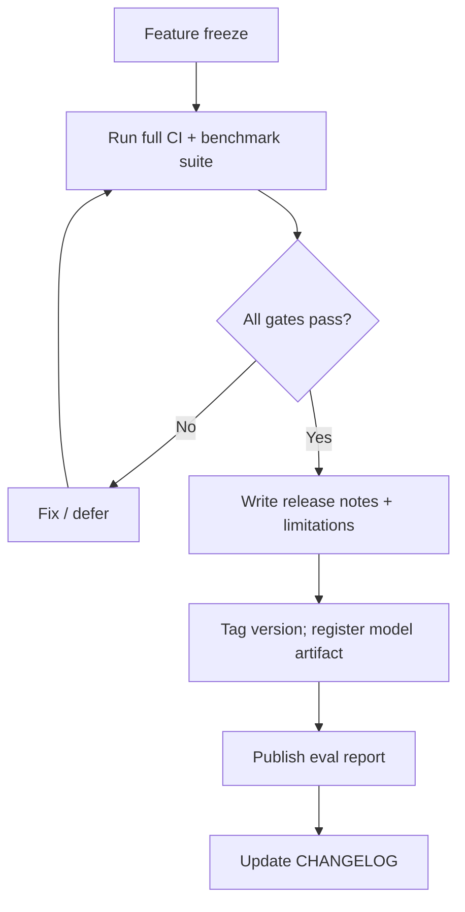

# Astra Releases

> Release process, criteria, and documentation.

**STATUS: PROPOSED**

---

## 1. Release Definition

A release is a **versioned snapshot** of the codebase plus (when applicable) a registered model artifact and full evaluation report. A release is not declared successful merely because the model runs.

## 2. Release Gates (Mandatory)

Before tagging, verify all:

| # | Gate | Evidence file |
|---|---|---|
| 1 | Tests passing (unit + integration) | CI report |
| 2 | Benchmarks completed (full suite on registered artifact) | `benchmarks/results/` + eval report |
| 3 | No critical regressions | gate report |
| 4 | Reproducible training run recorded | run manifest in `experiments/` |
| 5 | Documented architecture (docs current) | diff check |
| 6 | Documented limitations | `docs/*` + release notes |
| 7 | Resource measurements (latency/RAM/VRAM) | performance table in eval report |
| 8 | Model checksum/version | registry JSON |
| 9 | Changelog updated | this doc + `docs/CHANGELOG.md` |

## 3. Release Process



## 4. Release Notes Template

```
# Astra <version>

## Highlights
...
## Model artifacts
- checksum, param count, quantized variants
## Evaluation summary
- core suites results vs previous
- regressions (or none)
## Known limitations
... (honest)
## Changes since previous
...
## Data & reproducibility
- manifests used, seeds, hardware
## Rollback
- previous versions listed
```

## 5. Patch Releases

Fix-only, same scope: run smoke gates (tests + affected benchmarks). Patch bumps per `docs/VERSIONING.md`.

## 6. Definition of Done

- Tag exists with the anchor commit.
- CHANGELOG updated; release notes published.
- Model artifact registered with checksum (if model release).
- Eval report committed.
- Rollback plan documented.