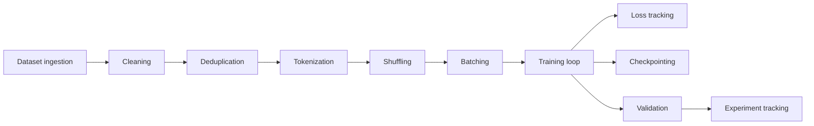

# Astra Training System

> The complete training pipeline specification.

**STATUS: PROPOSED** — pipeline design decided; individual components to be validated per phase.

---

## 1. Overview

The training system turns a verified, deduplicated, contamination-checked corpus into Astra checkpoints. It is:

- **Config-driven:** every run is fully specified by a config file + data manifest + recorded environment.
- **Reproducible:** same config + same data hash + same seed → same results within tolerance.
- **Auditable:** run manifests record the full environment (code commit, deps, hardware, timestamps, metrics).

---

## 2. Pipeline Stages

### 2.1 Dataset Ingestion

- Read from versioned manifests in `datasets/`.
- Record: source, license, provenance, hash, size, format, date.
- Reject manifests that fail safety/validation (see `docs/SAFETY.md`).

### 2.2 Cleaning

- Normalize text: detect encoding, strip BOM/NULs, collapse whitespace where appropriate (per corpus policy).
- Language-specific cleanup scripts live in `datasets/`.
- Every cleaning rule is recorded and versioned; none are undocumented transforms.

### 2.3 Deduplication

- Exact and fuzzy dedup using MinHash bucketing at document and paragraph level.
- Dedup applied **within** and **across** candidate corpora (to reduce eval contamination).
- Record dedup statistics in the dataset manifest (counts before/after).

### 2.4 Tokenization

- Run the configured tokenizer (`docs/TOKENIZER.md`) over the cleaned corpus.
- Store tokenized shards (efficient binary format) with the tokenizer version recorded.
- Never tokenize eval/benchmark data with a tokenizer version different from the one used for training data at that stage.

### 2.5 Shuffling

- Deterministic shuffle with recorded seed and shuffle buffer; a fixed shuffle hash is recorded per epoch.

### 2.6 Batching

- Construct batches of `context_length` tokens.
- Split across gradient-accumulation steps per GPU-config.
- DataLoader prefetch and memory mapping for CPU-bound token loading.

### 2.7 Training Loop

Front-end reference implementation in Python (PyTorch), back-end optimization in Rust where motivated by profiling. Standard loop:

1. Forward pass (causal LM).
2. Cross-entropy loss over tokens.
3. Backward; gradient clipping at 1.0.
4. Optimizer step (AdamW).
5. Scheduler step (cosine w/ warmup).
6. Periodic validation + checkpoint.

### 2.8 Loss Tracking & Perplexity

- Loss aggregated (mean and per-shard) on a sliding window.
- Perplexity `exp(loss)` reported at defined validation steps.
- Loss curves and per-token distributions logged to experiment tracker.

### 2.9 Checkpointing

- Checkpoints saved at fixed step intervals and at best-validation-loss.
- Every checkpoint gets: weight file, optimizer state (optional), config snapshot, data manifest hash, training-state snapshot (step, lr, rng state), and a SHA-256 checksum.
- Resume must reproduce deterministic-bit-equal state from the snapshot.

### 2.10 Validation

- Validation on the frozen validation split at every N steps with identical config and seeds.
- Never tunes hyperparameters on validation loss alone; use the eval suite (see `docs/EVALUATION.md`).

### 2.11 Experiment Tracking

- Every run writes a **run manifest**:
  - Repo commit, dependency lock
  - Config file + resolved config JSON
  - Data manifest + hashes
  - Seed, hardware, driver/GPU info
  - Metrics stream (loss). 
- Experiments are linked from `experiments/`.

### 2.12 Distributed Training (Future Capability)

- DDP (Data Parallel) planned as first distributed mode; FSDP (sharded) and context parallel as research.
- Design constraint: configs and manifests must be identical regardless of the number of devices; only data sharding changes.
- Distributed training is **not** required for early phases (consumer hardware single-GPU first).

---

## 3. Optimizer & Scheduling

| Component | Baseline | Notes |
|---|---|---|
| Optimizer | AdamW | bias/norm terms excluded from decay |
| LR schedule | Cosine with warmup (warmup ~2% of steps) | sweep in Phase 2 |
| Weight decay | 0.1 | |
| Gradient clip | 1.0 | |
| Batch | 0.5M–4M tokens | scale-dependent |

All hyperparameters resolve from config; optimizer registry pattern allows new optimizers (e.g., Lion, Sophia) without touching the loop.

---

## 4. Mixed Precision

- **bf16** where available (H100/A100); **fp16** with loss scaling fallback for consumer GPUs.
- A reference `bf16` path and `fp16` path; selected by capability probe at startup.
- Any precision path change must be validated: same-config train must reproduce within tolerance.

---

## 5. Reproducibility Contract

A training run is reproducible if, given (a) the same config, (b) same input data shards with same hash, (c) same seed, (d) same kernel/arithmetic (CUDA determinism enabled), the loss trajectory matches within a documented tolerance (target: identical within numerical precision tolerances of bf16 fp noise, at least step-matched).

Hard edges:
- Forced deterministic RNG where the framework supports it.
- All nondeterministic ops declared via config flag.
- Known nondeterminism sources documented per run in the manifest.

---

## 6. Pretraining vs. Adaptive Learning

| Aspect | Pretraining | Adaptive (continued) learning |
|---|---|---|
| Purpose | Language modeling foundation | Improve on verified feedback/tasks |
| Data | Large curated corpus | Verified experiences, corrections |
| Objective | Next-token loss | Mixed objective (LM loss + preference/feedback loss) |
| Data volume | Huge | Small-to-moderate |
| Learning rate | Higher peak, long schedule | Very small (or low-rank adapters) |
| Checkpoint | Fresh from scratch / big resume | Candidate model from previous checkpoint |
| Evaluated by | Val loss + benchmarks | Full benchmark suite + feedback-specific metrics |
| Risk | Catastrophic forgetting is low | Catastrophic forgetting relevant; mitigated by low LR, adapters, retain replay |

Adaptive learning always happens on a **candidate** model, never the active deployed model in place.

---

## 7. Validation Rules

- Validation split is frozen for the project and never mixed with training (see `docs/DATA.md`).
- Tuning on val loss is allowed only for generic optimization; task selection and final accept/reject use the eval suite.
- Every checkpoint records its validation perplexity and a checksum.